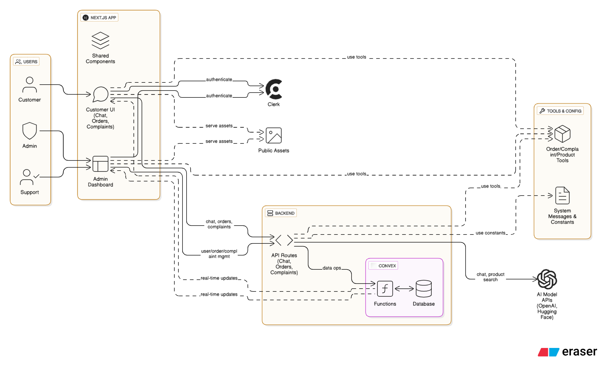

# AI Shopping Assistant – Fullstack Project

A modern, full-stack AI-powered shopping assistant platform with a customer-facing chat interface, product/order management, and a secure admin dashboard. Built with **Next.js 14 (App Router)**, **Clerk** authentication, **Convex** backend, and a modular, scalable architecture.

---

## 🚀 Features

- **AI Shopping Assistant**: Chat-based product search, order placement, and support
- **Image Upload Support**: Upload and analyze images for product identification and complaint assessment
- **Admin Dashboard**: Manage users, orders, complaints, and more
- **Next.js 14 App Router**: Modern app directory, layouts, server/client split
- **Clerk**: Authentication and user management
- **Convex**: Real-time backend/database
- **Tailwind CSS**: Modern, responsive UI
- **Modular Tools**: Order management, complaint handling, product search, etc.
- **Secure**: Admin-only routes, protected APIs, environment-based config

---

## 🖼️ Image Upload Feature

The chat interface now supports image uploads with the following capabilities:

### Supported Features:
- **Drag & Drop**: Simply drag images onto the upload area
- **File Browser**: Click "browse" to select images from your device
- **Multiple Images**: Upload up to 5 images per message
- **Image Analysis**: AI analyzes images for product identification and complaint assessment
- **Preview**: See uploaded images before sending
- **Remove**: Click the X button to remove unwanted images

### Supported Formats:
- JPEG, PNG, GIF, WebP, and other common image formats
- Maximum file size: 5MB per image
- Maximum images per message: 5

### Use Cases:
- **Product Identification**: Upload product images to find similar items in our catalog
- **Complaint Evidence**: Send images of damaged items or defects for complaint processing
- **Order Verification**: Share images of received items for order verification
- **General Support**: Include images to help explain issues or questions

### How to Use:
1. In the chat interface, you'll see a drag-and-drop area above the text input
2. Drag images onto this area or click "browse" to select files
3. Images will appear as thumbnails with the option to remove them
4. Add your message text (optional) and click send
5. The AI will analyze the images and respond accordingly

---

## 🖼️ Architecture Diagram



*High-level architecture: Users interact with the Next.js app (customer UI & admin dashboard), which authenticates via Clerk, uses shared components, and communicates with Convex backend and modular tools. AI models are used for chat and product search.*

---

## 🗂️ Folder Structure

```
youtube-ai-agent/
  app/
    admin/                  # Admin dashboard (layout, pages)
    orders/                 # Orders section (layout, client layout, pages)
    complaints/             # Complaints section (layout, client layout, pages)
    dashboard/              # User dashboard (chat, orders, etc.)
    api/                    # API routes (chat, stream, orders, etc.)
    ...                     # Other app routes/pages
  components/               # Reusable UI components (chat, sidebar, header, etc.)
  convex/                   # Convex backend logic (schema, queries, mutations)
  tools/                    # Custom tools (order, complaint, product search, etc)
  constants/                # System messages, config
  lib/                      # Utility libraries, context, types
  public/                   # Static assets
  README.md
  package.json
  ...
```

---

## 🧑‍💻 Getting Started

1. **Clone the repository:**
   ```bash
   git clone https://github.com/yourusername/youtube-ai-agent.git
   cd youtube-ai-agent
   ```

2. **Install dependencies:**
   ```bash
   pnpm install
   # or
   npm install
   # or
   yarn install
   ```

3. **Configure Environment Variables:**
   - Copy `.env.example` to `.env.local` and fill in your Clerk and Convex credentials.
   - Set up Clerk and Convex projects if you haven’t already (see their docs).

4. **Run the development server:**
   ```bash
   pnpm dev
   # or
   npm run dev
   # or
   yarn dev
   ```

5. **Access the app:**
   - Customer UI: [http://localhost:3000/](http://localhost:3000/)
   - Admin Dashboard: [http://localhost:3000/admin](http://localhost:3000/admin)

---

## 🛠️ Architecture & Patterns

### **Frontend**
- **Next.js 14 App Router**: Modern routing, layouts, server/client split
- **Tailwind CSS**: Utility-first styling
- **Components**: Modular, reusable, and colocated with features

### **Authentication**
- **Clerk**: Handles sign up, sign in, user sessions, and admin checks

### **Backend**
- **Convex**: Real-time database, queries, and mutations for orders, complaints, products, etc.
- **API Routes**: For chat, streaming, and order management

### **AI Tools**
- Modular tools in `/tools/` for product search, order management, complaint handling, etc.
- System messages and tool instructions in `/constants/`

### **Admin Dashboard**
- **Server/Client Layout Split**:  
  - `layout.tsx` (server): Exports metadata, renders client layout  
  - `[Section]LayoutClient.tsx` (client): Handles sidebar, navigation, user info, etc.

---

## 🧩 Adding New Features or Sections

1. **Create a new folder** in `app/` (e.g., `app/products/`)
2. **Add a `layout.tsx`** (server) and `[Section]LayoutClient.tsx` (client) if you need metadata and client hooks
3. **Add your page/components**
4. **Update the `navigation` array** in your client layout to include the new section

---

## 🔒 Security

- Only users with IDs in `ADMIN_USER_IDS` can access admin routes.
- All admin pages are protected and show an access denied message for unauthorized users.
- API routes and backend logic are protected by authentication and authorization checks.

---

## 📝 Customization

- **Navigation:**  Edit the `navigation` array in each client layout to add/remove sections.
- **Styling:**  Uses Tailwind CSS for rapid UI development. Customize in `app/globals.css` or component classes.
- **Backend:**  All data operations are handled via Convex functions in `convex/`.
- **System Messages:**  Update tool instructions and system prompts in `constants/systemMessage.ts`.

---

## 📦 Deployment

- Deploy on [Vercel](https://vercel.com/) or your preferred platform.
- Set all required environment variables in your deployment settings.

---

## 🤝 Contributing

Pull requests and issues are welcome! Please open an issue to discuss major changes.

---

## 📄 License

MIT

---

If you want to add badges, screenshots, or more advanced usage, let me know!
